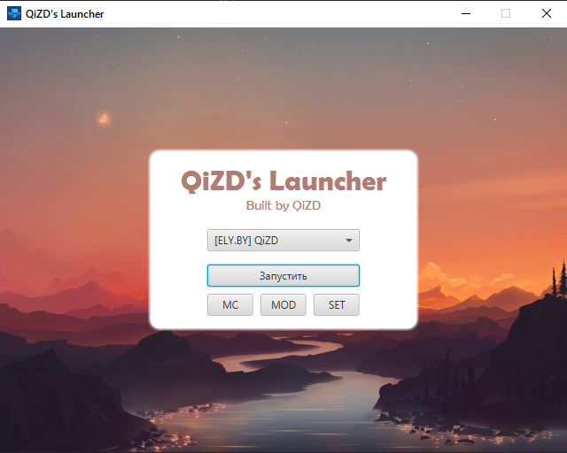

# QiZD's launcher
Custom launcher for Minecraft 1.19.2 for qizdmodpack. 

## Features
- Support for "plain" accounts and [ely.by](https://ely.by/) accounts
- Downloading and installing Minecraft 1.19.2, Fabric and authlib-injector with one button
- Downloading, installing and updating modpack from server with one button
- Multithreaded download: downloading Minecraft takes on my PC 1:36 seconds on average
- Beautiful unlicensed background pictures, straight from the first page of Google. (If you'd like your intellectual property to be removed, hit me up 😉)

## Building
You'll need JDK 17+ to build this project. Then just run
`gradle assembleDist` to build distributable archives.

## Usage
- Unpack your build archive somewhere.
- Run `bin/qizd-launcher.bat` to open the launcher app.
- Set home path in settings to your directory of choice (preferably in the same directory, where you put the launcher)
- Download JRE 17+ of your choice (I recommend [Adoptium](https://adoptium.net/)), and unpack it into your chosen home path in a folder `jre/`
- Add your profile
- Download Minecraft and modpack
- Enjoy